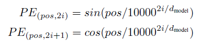
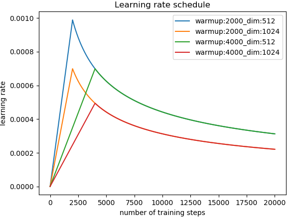
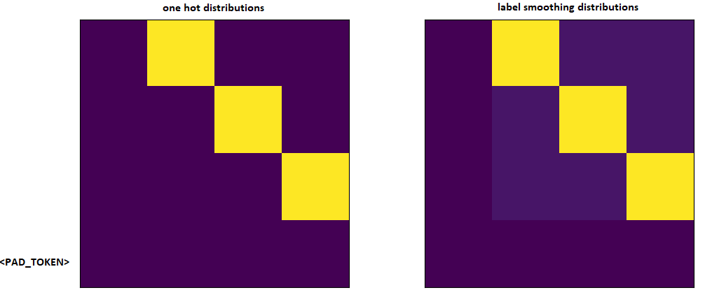
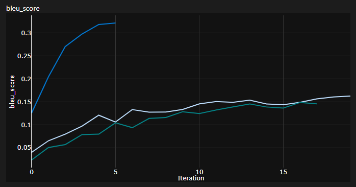
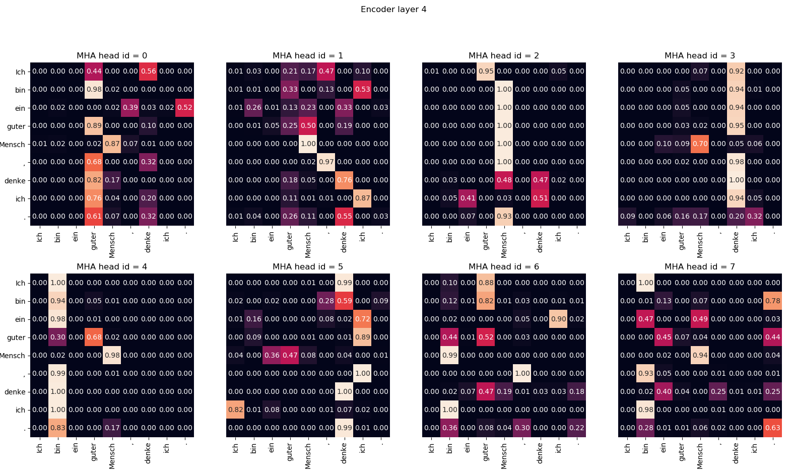
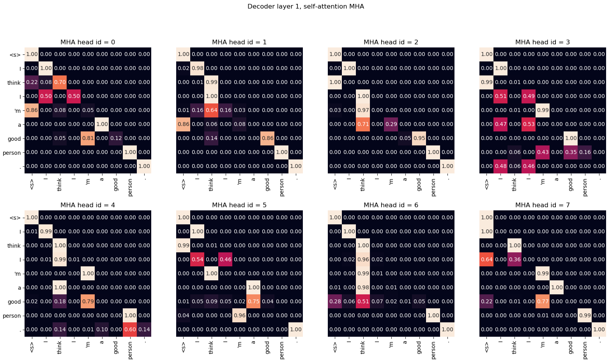

## The Original Transformer (PyTorch) :computer: = :rainbow:
This repo contains PyTorch implementation of the original transformer paper (:link: [Vaswani et al.](https://arxiv.org/abs/1706.03762)). <br/>
It's aimed at making it **easy to start playing and learning** about transformers. <br/>

## Table of Contents
  * [What are transformers?](#what-are-transformers)
  * [Understanding transformers](#understanding-transformers)
  * [Machine translation](#machine-translation)
  * [Setup](#setup)
  * [Usage](#usage)
  * [Hardware requirements](#hardware-requirements)

## What are transformers

Transformers were originally proposed by Vaswani et al. in a seminal paper called [Attention Is All You Need](https://arxiv.org/pdf/1706.03762.pdf).

You probably heard of transformers one way or another. **GPT-3 and BERT** to name a few well known ones :unicorn:. The main idea
is that they showed that you don't have to use recurrent or convolutional layers and that simple architecture coupled with attention is super powerful. It
gave the benefit of **much better long-range dependency modeling** and the architecture itself is highly **parallelizable** (:computer::computer::computer:) which leads to better compute efficiency!

Here is how their beautifully simple architecture looks like:

<p align="center">

</p>

## Understanding transformers

This repo is supposed to be a learning resource for understanding transformers as the original transformer by itself is not a SOTA anymore.

For that purpose the code is (hopefully) well commented and I've included the `playground.py` where I've visualized a couple
of concepts which are hard to explain using words but super simple once visualized. So here we go!

### Positional Encodings

Can you parse this one in a glimpse of the eye?

<p align="left">

</p>

Neither can I. Running the `visualize_positional_encodings()` function from `playground.py` we get this:

<p align="center">

</p>

Depending on the position of your source/target token you "pick one row of this image" and you add it to it's embedding vector, that's it.
They could also be learned, but it's just more fancy to do it like this, obviously! :nerd_face:

### Custom Learning Rate Schedule

Similarly can you parse this one in `O(1)`?

<p align="left">

</p>

Noup? So I thought, here it is visualized:

<p align="center">

</p>

It's super easy to understand now. Now whether this part was crucial for the success of transformer? I doubt it.
But it's cool and makes things more complicated. :nerd_face: (`.set_sarcasm(True)`)

*Note: model dimension is basically the size of the embedding vector, baseline transformer used 512, the big one 1024*

### Label Smoothing

First time you hear of label smoothing it sounds tough but it's not. You usually set your target vocabulary distribution
to a `one-hot`. Meaning 1 position out of 30k (or whatever your vocab size is) is set to 1. probability and everything else to 0.

<p align="center">

</p>

In label smoothing instead of placing 1. on that particular position you place say 0.9 and you evenly distribute the rest of
the "probability mass" over the other positions 
(that's visualized as a different shade of purple on the image above in a fictional vocab of size 4 - hence 4 columns)

*Note: Pad token's distribution is set to all zeros as we don't want our model to predict those!*

Aside from this repo (well duh) I would highly recommend you go ahead and read [this amazing blog](https://jalammar.github.io/illustrated-transformer/) by Jay Alammar!

## Machine translation

Transformer was originally trained for the NMT (neural machine translation) task on the [WMT-14 dataset](https://torchtext.readthedocs.io/en/latest/datasets.html#wmt14) for:
* English to German translation task (achieved 28.4 [BLEU score](https://en.wikipedia.org/wiki/BLEU))
* English to French translation task (achieved 41.8 BLEU score)
 
What I did (for now) is I trained my models on the [IWSLT dataset](https://torchtext.readthedocs.io/en/latest/datasets.html#iwslt), which is much smaller, for the
English-German language pair, as I speak those languages so it's easier to debug and play around.

I'll also train my models on WMT-14 soon, take a look at the [todos](#todos) section.

---

Anyways! Let's see what this repo can practically do for you! Well it can translate!

Some short translations from my German to English IWSLT model: <br/><br/>
Input: `Ich bin ein guter Mensch, denke ich.` ("gold": I am a good person I think) <br/>
Output: `['<s>', 'I', 'think', 'I', "'m", 'a', 'good', 'person', '.', '</s>']` <br/>
or in human-readable format: `I think I'm a good person.`

Which is actually pretty good! Maybe even better IMO than Google Translate's "gold" translation.

---

There are of course failure cases like this: <br/><br/>
Input: `Hey Alter, wie geht es dir?` (How is it going dude?) <br/>
Output: `['<s>', 'Hey', ',', 'age', 'how', 'are', 'you', '?', '</s>']` <br/>
or in human-readable format: `Hey, age, how are you?` <br/>

Which is actually also not completely bad! Because:
* First of all the model was trained on IWSLT (TED like conversations)
* "Alter" is a colloquial expression for old buddy/dude/mate but it's literal meaning is indeed age.

Similarly for the English to German model.

## Setup

So we talked about what transformers are, and what they can do for you (among other things). <br/>
Let's get this thing running! Follow the next steps:

1. `git clone https://github.com/gordicaleksa/pytorch-original-transformer`
2. Open Anaconda console and navigate into project directory `cd path_to_repo`
3. Run `conda env create` from project directory (this will create a brand new conda environment).
4. Run `activate pytorch-transformer` (for running scripts from your console or set the interpreter in your IDE)

That's it! It should work out-of-the-box executing environment.yml file which deals with dependencies. <br/>
It may take a while as I'm automatically downloading SpaCy's statistical models for English and German.

-----

PyTorch pip package will come bundled with some version of CUDA/cuDNN with it,
but it is highly recommended that you install a system-wide CUDA beforehand, mostly because of the GPU drivers. 
I also recommend using Miniconda installer as a way to get conda on your system.
Follow through points 1 and 2 of [this setup](https://github.com/Petlja/PSIML/blob/master/docs/MachineSetup.md)
and use the most up-to-date versions of Miniconda and CUDA/cuDNN for your system.

## Usage

#### Option 1: Jupyter Notebook

Just run `jupyter notebook` from you Anaconda console and it will open the session in your default browser. <br/>
Open `The Annotated Transformer ++.ipynb` and you're ready to play! <br/>

---

**Note:** if you get `DLL load failed while importing win32api: The specified module could not be found` <br/>
Just do `pip uninstall pywin32` and then either `pip install pywin32` or `conda install pywin32` [should fix it](https://github.com/jupyter/notebook/issues/4980)!

#### Option 2: Use your IDE of choice

You just need to link the Python environment you created in the [setup](#setup) section.

### Training

To run the training start the `training_script.py`, there is a couple of settings you will want to specify:
* `--batch_size` - this is important to set to a maximum value that won't give you CUDA out of memory
* `--dataset_name` - Pick between `IWSLT` and `WMT14` (WMT14 is not advisable [until I add](#todos) multi-GPU support)
* `--language_direction` - Pick between `E2G` and `G2E`

So an example run (from the console) would look like this: <br/>
`python training_script.py --batch_size 1500 --dataset_name IWSLT --language_direction G2E`

The code is well commented so you can (hopefully) understand how the training itself works. <br/>

The script will:
* Dump checkpoint *.pth models into `models/checkpoints/`
* Dump the final *.pth model into `models/binaries/`
* Download IWSLT/WMT-14 (the first time you run it and place it under `data/`)
* Dump [tensorboard data](#evaluating-nmt-models) into `runs/`, just run `tensorboard --logdir=runs` from your Anaconda
* Periodically write some training metadata to the console

*Note: data loading is slow in torch text, and so I've implemented a custom wrapper which adds the caching mechanisms
and makes things ~30x faster! (it'll be slow the first time you run stuff)*

### Inference (Translating)

The second part is all about playing with the models and seeing how they translate! <br/>
To get some translations start the `translation_script.py`, there is a couple of settings you'll want to set:
* `--source_sentence` - depending on the model you specify this should either be English/German sentence
* `--model_name` - one of the pretrained model names: `iwslt_e2g`, `iwslt_g2e` or your model(*)
* `--dataset_name` - keep this in sync with the model, `IWSLT` if the model was trained on IWSLT
* `--language_direction` - keep in sync, `E2G` if the model was trained to translate from English to German

(*) Note: after you train your model it'll get dumped into `models/binaries` see what it's name is and specify it via
the `--model_name` parameter if you want to play with it for translation purpose. If you specify some of the pretrained
models they'll **automatically get downloaded** the first time you run the translation script.

I'll link IWSLT pretrained model links here as well: [English to German](https://www.dropbox.com/s/a6pfo6t9m2dh1jq/iwslt_e2g.pth?dl=1) and [German to English.](https://www.dropbox.com/s/dgcd4xhwig7ygqd/iwslt_g2e.pth?dl=1)

That's it you can also visualize the attention check out [this section.](#visualizing-attention) for more info.

### Evaluating NMT models

I tracked 3 curves while training:
* training loss (KL divergence, batchmean)
* validation loss (KL divergence, batchmean)
* BLEU-4 

[BLEU is an n-gram based metric](https://www.aclweb.org/anthology/P02-1040.pdf) for quantitatively evaluating the quality of machine translation models. <br/>
I used the BLEU-4 metric provided by the awesome **nltk** Python module.

Current results, models were trained for 20 epochs (DE stands for Deutch i.e. German in German :nerd_face:):

| Model | BLEU score | Dataset |
| --- | --- | --- |
| [Baseline transformer (EN-DE)](https://www.dropbox.com/s/a6pfo6t9m2dh1jq/iwslt_e2g.pth?dl=1) | **27.8** | IWSLT val |
| [Baseline transformer (DE-EN)](https://www.dropbox.com/s/dgcd4xhwig7ygqd/iwslt_g2e.pth?dl=1) | **33.2** | IWSLT val |
| Baseline transformer (EN-DE) | x | WMT-14 val |
| Baseline transformer (DE-EN) | x | WMT-14 val |

I got these using greedy decoding so it's a pessimistic estimate, I'll add beam decoding [soon.](#todos)

**Important note:** Initialization matters a lot for the transformer! I initially thought that other implementations
using Xavier initialization is again one of those arbitrary heuristics and that PyTorch default init will do - I was wrong:

<p align="center">

</p>

You can see here 3 runs, the 2 lower ones used PyTorch default initialization (one used `mean` for KL divergence
loss and the better one used `batchmean`), whereas the upper one used **Xavier uniform** initialization!
 
---

Idea: you could potentially also periodically dump translations for a reference batch of source sentences. <br/>
That would give you some qualitative insight into how the transformer is doing, although I didn't do that. <br/>
A similar thing is done when you have hard time quantitatively evaluating your model like in [GANs](https://github.com/gordicaleksa/pytorch-gans) and [NST](https://github.com/gordicaleksa/pytorch-nst-feedforward) fields.

### Tracking using Tensorboard

The above plot is a snippet from my Azure ML run but when I run stuff locally I use Tensorboard.

Just run `tensorboard --logdir=runs` from your Anaconda console and you can track your metrics during the training.

### Visualizing attention

You can use the `translation_script.py` and set the `--visualize_attention` to True to additionally understand what your
model was "paying attention to" in the source and target sentences.

Here are the attentions I get for the input sentence `Ich bin ein guter Mensch, denke ich.`

These belong to layer 6 of the encoder. You can see all of the 8 multi-head attention heads.

<p align="center">

</p>

And this one belongs to decoder layer 6 of the self-attention decoder MHA (multi-head attention) module. <br/>
You can notice an interesting **triangular pattern** which comes from the fact that target tokens can't look ahead!

<p align="center">

</p>

The 3rd type of MHA module is the source attending one and it looks similar to the plot you saw for the encoder. <br/>
Feel free to play with it at your own pace!

*Note: there are obviously some bias problems with this model but I won't get into that analysis here*

## Hardware requirements

You really need a decent hardware if you wish to train the transformer on the **WMT-14** dataset.

The authors took:
* **12h on 8 P100 GPUs** to train the baseline model and **3.5 days** to train the big one.

If my calculations are right that amounts to ~19 epochs (100k steps, each step had ~25000 tokens and WMT-14 has ~130M src/trg tokens)
for the baseline and 3x that for the big one (300k steps).

On the other hand it's much more feasible to train the model on the **IWSLT** dataset. It took me:
* 13.2 min/epoch (1500 token batch) on my RTX 2080 machine (8 GBs of VRAM)
* ~34 min/epoch (1500 token batch) on Azure ML's K80s (24 GBs of VRAM)

I could have pushed K80s to 3500+ tokens/batch but had some CUDA out of memory problems.

### Todos:

Finally there are a couple more todos which I'll hopefully add really soon:
* Multi-GPU/multi-node training support (so that you can train a model on WMT-14 for 19 epochs)
* Beam decoding (turns out it's not that easy to implement this one!)
* BPE and shared source-target vocab (I'm using SpaCy now)

The repo already has everything it needs, these are just the bonus points. I've tested everything
from environment setup, to automatic model download, etc.

## Video learning material

If you're having difficulties understanding the code I did an in-depth overview of the paper [in this video:](https://www.youtube.com/watch?v=cbYxHkgkSVs)

<p align="left">
<a href="https://www.youtube.com/watch?v=cbYxHkgkSVs" target="_blank"></a>
</p>

I have some more videos which could further help you understand transformers:
* [My approach to understanding NLP/transformers](https://www.youtube.com/watch?v=bvBK-coXf9I)
* [Another overview of the paper (a bit higher level)](https://www.youtube.com/watch?v=n9sLZPLOxG8)
* [A case study of how this project was developed](https://www.youtube.com/watch?v=px4rtkWHFvM)

## Acknowledgements

I found these resources useful (while developing this one):

* [The Annotated Transformer](http://nlp.seas.harvard.edu/2018/04/03/attention.html)
* [PyTorch official implementation](https://github.com/pytorch/pytorch/blob/187e23397c075ec2f6e89ea75d24371e3fbf9efa/torch/nn/modules/transformer.py)

I found some inspiration for the model design in the The Annotated Transformer but I found it hard to understand, and
it had some bugs. It was mainly written with researchers in mind. Hopefully this repo opens up
the understanding of transformers to the common folk as well! :nerd_face:

## Citation

If you find this code useful, please cite the following:

```
@misc{Gordić2020PyTorchOriginalTransformer,
  author = {Gordić, Aleksa},
  title = {pytorch-original-transformer},
  year = {2020},
  publisher = {GitHub},
  journal = {GitHub repository},
  howpublished = {\url{https://github.com/gordicaleksa/pytorch-original-transformer}},
}
```

## Connect with me

If you'd love to have some more AI-related content in your life :nerd_face:, consider:
* Subscribing to my YouTube channel [The AI Epiphany](https://www.youtube.com/c/TheAiEpiphany) :bell:
* Follow me on [LinkedIn](https://www.linkedin.com/in/aleksagordic/) and [Twitter](https://twitter.com/gordic_aleksa) :bulb:
* Follow me on [Medium](https://gordicaleksa.medium.com/) :books: :heart:

## Licence

[](https://github.com/gordicaleksa/pytorch-original-transformer/blob/master/LICENCE)